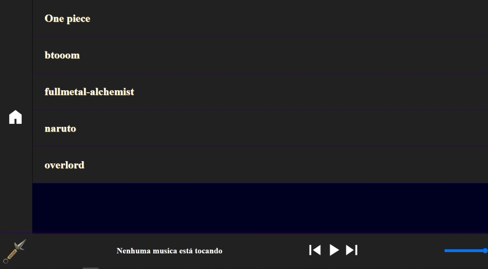

# AnimeMusic
Projeto de estudo - Uma cópia do spotify focado em animes

<h1>Tala Principal</h1>
    
    
Aqui é um site focado para eu aprender mais sobre tratar dados vindo do banco de dados. Aqui estou usando o FireBase pra ser mais pratico
 

No começo eu pensei em colocar tudo no banco de dados, mas acabei descobrindo que o proprio spotifi tem uma API e quero fazer uma segunda versão com isso
 

O intuito desse projeto é só para organizar as aberturas de animes e ouvir
